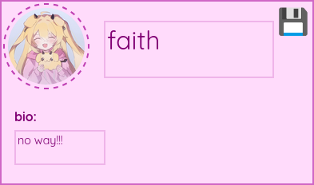

# faithchat

silly chat app inspired by discord

i have no intentions of actually hosting this, its just a fun project :3

# features

- ### themes
  
   currently themes are light or dark and have a custom hue slider that recolours the ui based on a single value  
   
     
   

- ### profiles

   each user has a profile with a username, bio and a default auto-generated profile picture

   
  
   default pfps are auto-generated by hashing the users public account uuid and using the first 6 bytes for 2 rgb values for the gradient and adding a ":3" which is contrast-aware
  
   
  
   all aspects of the visible profile (bio, profile picture and username) are fully editable

- ### chats
   supports dedicated chats with isolated message histories
  
     
   
